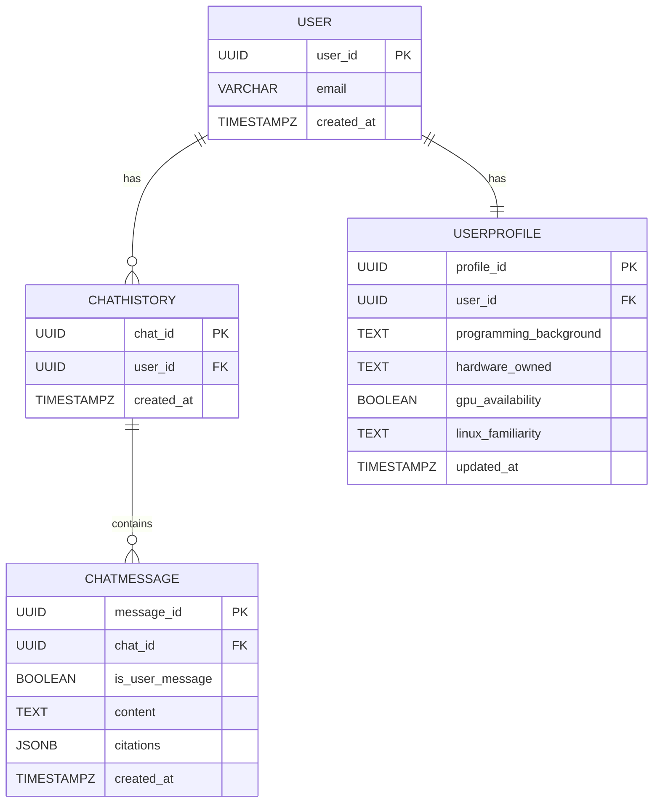

# Data Model: RAG Chatbot and User Features

This document defines the data models for the entities required for the RAG chatbot and interactive user features. The models are designed to be implemented using Neon Serverless Postgres.

## 1. User

Represents a user of the platform.

-   **user_id**: `UUID` (Primary Key) - Unique identifier for the user.
-   **email**: `VARCHAR(255)` (Unique, Not Null) - User's email address, retrieved from Better-Auth.
-   **created_at**: `TIMESTAMPZ` (Not Null) - Timestamp of user creation.

## 2. UserProfile

Stores the professional background and preferences of a user. This data is collected during the signup process.

-   **profile_id**: `UUID` (Primary Key) - Unique identifier for the profile.
-   **user_id**: `UUID` (Foreign Key to User, One-to-One) - Links to the user.
-   **programming_background**: `TEXT` - User's description of their programming experience.
-   **hardware_owned**: `TEXT` - User's description of the hardware they own.
-   **gpu_availability**: `BOOLEAN` - Whether the user has a GPU available.
-   **linux_familiarity**: `TEXT` - User's level of familiarity with Linux.
-   **updated_at**: `TIMESTAMPZ` (Not Null) - Timestamp of the last profile update.

## 3. ChatHistory

Stores a record of chat interactions for each user.

-   **chat_id**: `UUID` (Primary Key) - Unique identifier for a chat session.
-   **user_id**: `UUID` (Foreign Key to User) - The user who initiated the chat.
-   **created_at**: `TIMESTAMPZ` (Not Null) - Timestamp when the chat session started.

## 4. ChatMessage

Stores an individual message within a chat session.

-   **message_id**: `UUID` (Primary Key) - Unique identifier for the message.
-   **chat_id**: `UUID` (Foreign Key to ChatHistory) - The chat session this message belongs to.
-   **is_user_message**: `BOOLEAN` (Not Null) - `true` if the message is from the user, `false` if it's from the chatbot.
-   **content**: `TEXT` (Not Null) - The text of the message.
-   **citations**: `JSONB` (Nullable) - If the message is from the chatbot, this field can store source citations from the book.
-   **created_at**: `TIMESTAMPZ` (Not Null) - Timestamp of the message.

## Entity-Relationship Diagram (ERD)

